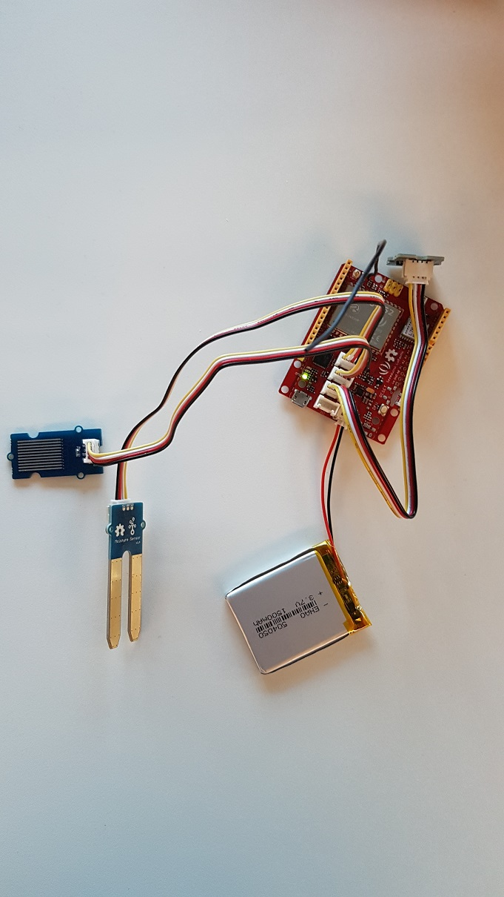
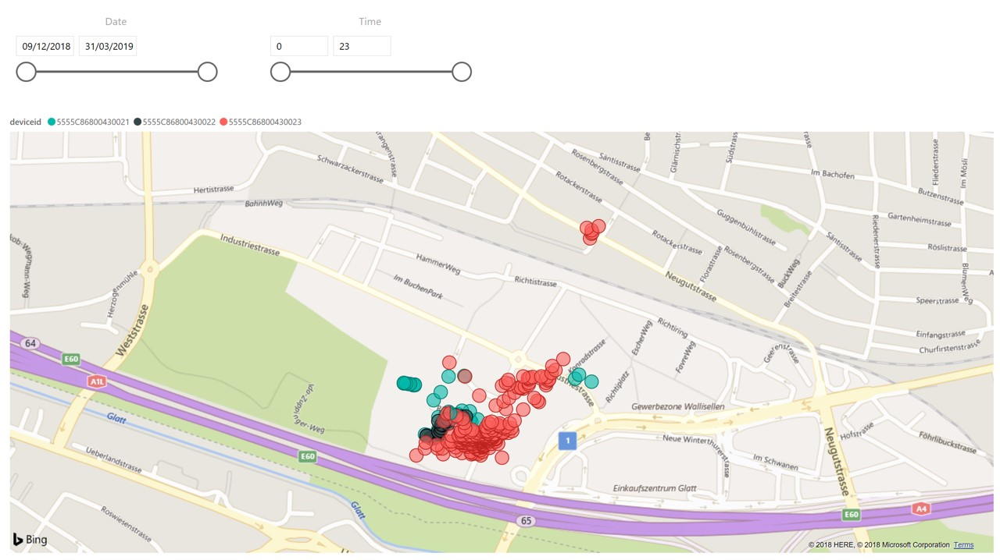

# 2 LoRaWan examples using GPS and various sensors

The [Azure IoT Edge LoRaWAN Starter Kit](https://github.com/Azure/iotedge-lorawan-starterkit) is a great way to connect any LoRa device to Azure IoT Edge in a very simple way. LoRa devices are long range, low bit rate transmission and reception devices thru a gateway. We're not speaking here of large amounts of data but only few bytes every time.

Not entering in the details, the idea is to optimize the data you send and don't send them too often. In those examples, I'm sending the data quite often so for the real life, it should be adjusted.

## Sending telemetry data like water level and humidity

For one of our customer, we've help them build a prevention system measuring the level of water in rivers, the soil humidity and the presence of rain in an autonomous LoRa device. I will only present here the code that is related to the sensors and the connection with the rest of the solution in Azure IoT Edge.

### Hardware

This samples were tested with the [Seeeduino LoRaWan boards](http://wiki.seeedstudio.com/Seeeduino_LoRAWAN/). The LoRaWan library (referenced thru "LoRaWan.h" in the ino files) is coming when you select the platform as a Seeeduino LoRaWan board.


We will use the following sensors:

* Soil humidity, any with a Groove connection using analogic pin is working
* A water level/water presence sensor, any with a Groove connection using analogic pin is working
* A distance sensor using a chip vl53l0x which is available with Groove connectivity using i2c
    * Interest of this sensor is to be able to measure precisely a distance from 10 to 2000 millimeters
    * Sensor has a high precision and normal precision mode.
    * All up, the documentation is really great and it's very simple to use
* The battery level and if it's charging or not. The good news is that it is embedded into the this great board



### Encoding the data

The goal as we will use Lora is to sent the minimum payload, so minimizing the number of bytes to send.

Playing a bit with the data and the quality of the sensors plus what we really want to analyze further, we can get the following table:

| Sensor | Min | Max | # of bits |
| --- | --- | --- | --- |
| Time to Flight | 10 | 2000 | 11 |
| Water Sensor | 0 | 511 | 9 |
| Soil Humid | 0 | 511 | 9 |
| Battery Level | 0 | 3 | 2 |
| Charging | 0 | 1 | 1 |
| **Total** |   |   | 32 |

So far having the Coil humidity and Water sensor on 9 bits is quite luxury, we can still cut it more and depending on the all up quality of the sensor, 5 bits both so 0 to 31 as values should be largely enough which should save us a bit more space.

We will then pack the bits like in the following table:

| Sensor | Bits |
| --- | --- |
| TF | 0->10 |
| WS | 11->19 |
| SH | 20->28 |
| BA | 29->30 |
| CH | 30->31 |

The code is quite simple and straight forward. Few things to pay attention:

* No data will be sent if you don't have a real vl53l0x physically plugged into the board.
* The error value for the vl53l0x is 0. As the minimum value which can be sent is 10, we are using 0 for error.
    * To improve, it's possible to use as well values up to 9.
    * As an example, 0 can be used for error in measurement, 1 is the sensor is not present
* The battery level is not a proportion. According to the [documentation](http://wiki.seeedstudio.com/Seeeduino_LoRAWAN/), the value measure is the battery tension:
    * float v = a/1023.0*3.3*11.0;        // there's an 1M and 100k resistor divider
    * tests shows that at 2.5V, the board stops sending data thru LoRa, so the minimum value is 70, the battery is supposed to be a standard Lipo one at 3.7V which then translate to 105 as a measure
    * We will then use 0 = fully discharged battery with a measure below 78
    * 1 when between 78 and 87
    * 2 when between 87 and 96
    * 3 when fully charged which is higher than 96
    * This can be adjusted with more tests but the logic is here

The encoding function can be found in the code as well:

```C
void EncodeData(int distance, int waterLevel, int soilHumid, int battery, int charging)
{
    data[0] = distance & 0xFF;
    data[1] = (distance >> 8) & 0x07;
    data[1] = data[1] | ((waterLevel & 0x1F) << 3);
    data[2] = (waterLevel >> 3) & 0x0F;
    data[2] = data[2] | ((soilHumid & 0x0F) << 4);
    data[3] = (soilHumid >> 4) & 0x1F;
    data[3] = data[3] | ((battery & 0x03) << 5);
    data[3] = data[3] | ((charging & 0x01) << 7);
}
```

### Decoding the data

The decoding function will be in C# part of the [Azure IoT Edge LoRaWAN Starter Kit](https://github.com/Azure/iotedge-lorawan-starterkit). In order to test the decoder, I created the same encoding function in C#. It's basically a copy/paste of the C code with couple of casts :-)

```C#
        static void EncodeData(int distance, int waterLevel, int soilHumid, int battery, int charging)
        {
            data[0] = (byte)(distance & 0xFF);
            data[1] = (byte)((distance >> 8) & 0x07);
            data[1] = (byte)(data[1] | ((waterLevel & 0x1F) << 3));
            data[2] = (byte)((waterLevel >> 3) & 0x0F);
            data[2] = (byte)(data[2] | ((soilHumid & 0x0F) << 4));
            data[3] = (byte)((soilHumid >> 4) & 0x1F);
            data[3] = (byte)(data[3] | ((battery & 0x03) << 5));
            data[3] = (byte)(data[3] | ((charging & 0x01) << 7));
            Console.WriteLine($"{BitConverter.ToString(data)}");
        }
```

It then allow to create a decoding function with the same definition whihc is needed by the decoding engine:

```C#
        static string DecoderWaterSensors(byte[] payload, uint fport)
        {
            if (payload.Length != 4)
                return null;

            WaterSensors waterSensors = new WaterSensors();
            waterSensors.WaterLevel = payload[0] + ((payload[1] & 0x07) << 8);
            waterSensors.WaterPresence = ((payload[1] >> 3) & 0x1F) + ((payload[2] & 0x0F) << 3);
            waterSensors.SoilHumidity = ((payload[2] >> 4) & 0x0F) + ((payload[3] & 0x1F) << 4);
            waterSensors.Battery = (payload[3] >> 5) & 0x03;
            if ((byte)(payload[3] & 0x80) == 0x80)
                waterSensors.Charging = true;
            else
                waterSensors.Charging = false;

            return JsonConvert.SerializeObject(waterSensors);
        }

        public class WaterSensors
        {
            public int WaterLevel { get; set; }
            public int WaterPresence { get; set; }
            public int SoilHumidity { get; set; }
            public int Battery { get; set; }
            public bool Charging { get; set; }
        }
```

And to test it, we just try every single component with their min and max values. Can be done with few more random data. And not as well, that it's of course possible to create a unit test associated to it.

```C#
        static byte[] data = new byte[4];
        static int distance = 0;
        static int waterLevel = 0;
        static int soilHumid = 0;
        static int battery = 0;
        static int charging = 0;

        static void Main(string[] args)
        {
            // set everythign to 0, encode and decode
            EncodeDecode(distance, waterLevel, soilHumid, battery, charging);
            // Now check the full value individually
            distance = 2000;
            EncodeDecode(distance, waterLevel, soilHumid, battery, charging);
            distance = 0; waterLevel = 511;
            EncodeDecode(distance, waterLevel, soilHumid, battery, charging);
            waterLevel = 0; soilHumid = 511;
            EncodeDecode(distance, waterLevel, soilHumid, battery, charging);
            soilHumid = 0; battery = 3;
            EncodeDecode(distance, waterLevel, soilHumid, battery, charging);
            battery = 0; charging = 1;
            EncodeDecode(distance, waterLevel, soilHumid, battery, charging);
            Console.ReadKey();
        }

        static void EncodeDecode(int distance, int waterLevel, int soilHumid, int battery, int charging)
        {
            Console.WriteLine($"Height: {distance} WaterLevel: {waterLevel} SoilHumidity: {soilHumid} Battery: {battery} Charging: {charging}");
            EncodeData(distance, waterLevel, soilHumid, battery, charging);
            Console.WriteLine(DecoderWaterSensors(data, 1));
        }
```

It's a very simple way to make sure the data are encoding and decoding properly. Later on, this code has been integrated in a more complex solution and unit tests has been added.

### Sending the data with LoRa

The LoRaWan library provided by Seeed Studio is just great. Usage is as in the [documentation](http://wiki.seeedstudio.com/Seeeduino_LoRAWAN/). We've provided 2 implementations of the code, one in OTA and one in ABP mode. OTA is when the device needs to join to get its encryption keys, the second case in ABP is when the device is already joined and have already its keys.

Note that in this example, we're using only 3 channels in the EU region. It's possible to use up to 8. And the Data rate used here is 6 which is not long range. Use 12 for a long range. If you want example for US, just look at the [next example](GPSTracker/GPSTracker.ino), it does support either EU, either US.

### What to do with the data?

Data were used directly into a [Power BI](https://powerbi.microsoft.com) dashboard using time series. You can really do whatever you want with them, store them into tables, SQL database, display them real time, it's really up to you!

Note as well that using Azure as a backend and elements like Azure Stream Analytics allows to raise alerts when some threshold are passed. For example, in the scenario, if the level of water gets up to a certain point, an alert is automatically raised.

### Putting everything together

You'll need to setup an [Azure IoT Edge LoRaWAN Starter Kit](https://github.com/Azure/iotedge-lorawan-starterkit) to have all things working together. Follow the documentation, create your own Azure IoT Hub, your own device and you're good to go :-) 

## Sending GPS coordinates

For this example, the idea is to have lots of LoRa devices in a search and rescue scenario. Imagine an avalanche just happened and you need to search a large area. You have volunteers and dogs. And you must make sure that every single square meter has been covered that nothing is missing.

As usually in those kind of situation, you don't have access to network cover, so it has to be done in a different way.

LoRa is using low data rate and long range which is great to cover such scenarios. You'll need one gateway and only one point where you may have internet access (thru phone, satellite or even no connection at all). The issue with LoRa is that when you have too many devices, the network starts to saturate so it is critical to make sure the data are as optimized as possible. If your LoRa network is very well optimize, you can have 300 devices on the same gateway. But if all starts to send tens of bytes every minutes, then you'll be totally saturated.

### Hardware

For this one, we'll use on the [Seeeduino LoRaWan board](http://wiki.seeedstudio.com/Seeeduino_LoRAWAN/). It does work on a simple LiPo battery which will stand for a day (if the battery is not at extreme temperatures). It has an embedded GPS and the LoRaWan module, so all what wee need!

The library used to decode the MNEA messages is TinyGPS. You'll find it on [Github](https://github.com/mikalhart/TinyGPS), just clone it into your Ardunio library folder.

### Encoding the data

The core principle is to send either the full coordinates either a delta of coordinates either nothing if the person/dog hasn't move enough.

When sending the full coordinates, we will use 9 bytes, 4 for longitude, 4 for latitude and 1 for the precision. Full position is sent every 10 positions. So if the person is running it's about every 50 meters.

When sending the delta, we will only send 2 bytes, 1 for the longitude and 1 for the latitude. Choice has been done to send only delta when larger than 5m. It's a good compromise between the GPS precision and the potential movement.

But time to time, we still send the full data to make sure that if any issue happened, we will still have some full data.

Those variables are fully customizable in the device code. Note that in the code, there is as well the possible to always send a full position. That can be as well done at runtime for example. You can imagine sending a message from the cloud to the LoRa device telling if position should be sent full or partial as well as adjusting the sensitivity of delta position. This is not implemented in this example but it's quite easy to implement.

### Decoding the data

The [decoder](endoer-decoder/GPSEncoderDecoder.cs) takes the 2 cases, if it's only a delta or a full position.

### Sending the data with LoRa

Data are sent thru the LoRa module like in the previous example. This example shows as well how you can use either US either EU settings for LoRa. As well offers the possibility to not send the LoRa messages at all if you just want to debug the code or run it on a device with another type of GPS.

### What to do with the data?

Idea of those kind of data is to display them on a map. You can directly take them from IoT Hub as a stream and place them into a [Power BI](https://powerbi.microsoft.com) with a map. In our case, the data will be stored locally as well, supporting offline scenarios with local maps.

The below example shows 3 devices on a map in Power BI.



### Putting everything together

You'll need to setup an [Azure IoT Edge LoRaWAN Starter Kit](https://github.com/Azure/iotedge-lorawan-starterkit) to have all things working together. Follow the documentation, create your own Azure IoT Hub, your own device and you're good to go.